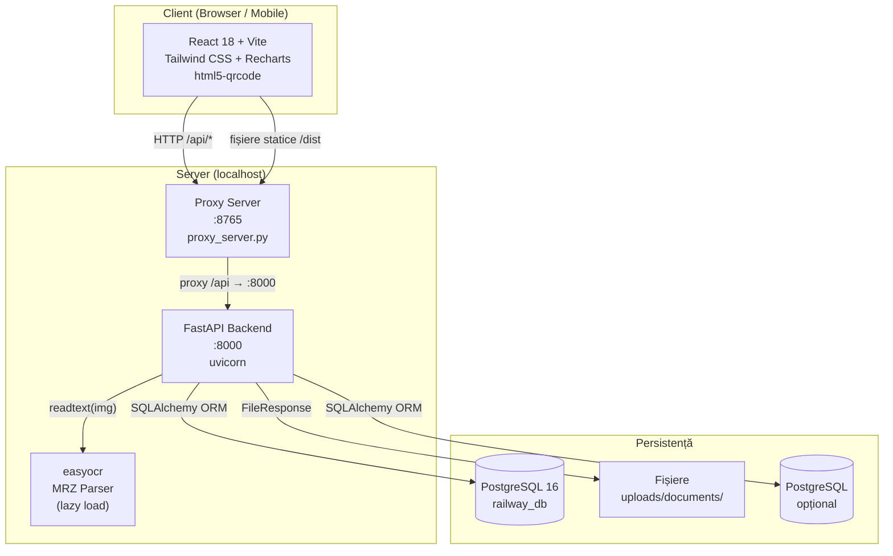
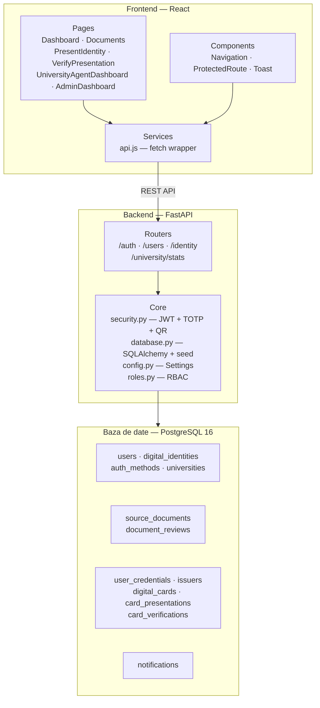
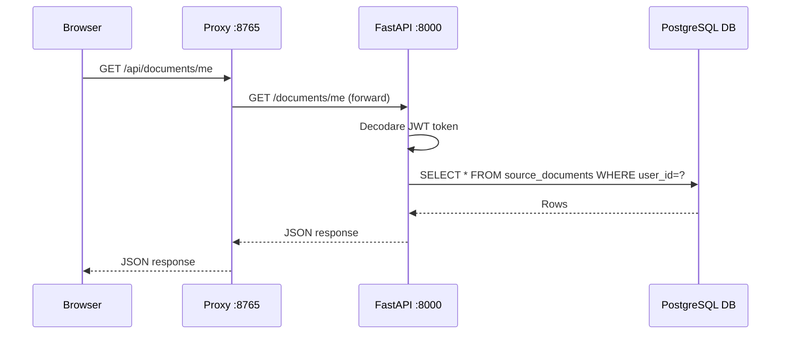

# Diagrama Arhitectură

## Arhitectura generală

---

## Arhitectura detaliată — straturi

---

## Stack tehnologic

| Strat | Tehnologie | Versiune |
|-------|-----------|---------|
| Frontend | React | 18 |
| Build tool | Vite | 5.x |
| Stilizare | Tailwind CSS | 3.x |
| Grafice | Recharts | 2.x |
| Scanner QR | html5-qrcode | 2.x |
| Backend | FastAPI | 0.109 |
| Server ASGI | Uvicorn | 0.27 |
| ORM | SQLAlchemy | 2.x |
| Autentificare | JWT (PyJWT) + TOTP (pyotp) | — |
| OCR | easyocr | 1.7+ |
| QR generare | qrcode | 7.4 |
| Baza de date | PostgreSQL 16 | Docker container (`docker-compose up -d db`) |
| Baza de date (prod) | PostgreSQL | 15+ |
| Containerizare | Docker + Docker Compose | — |

---

## Fluxul unei cereri HTTP

