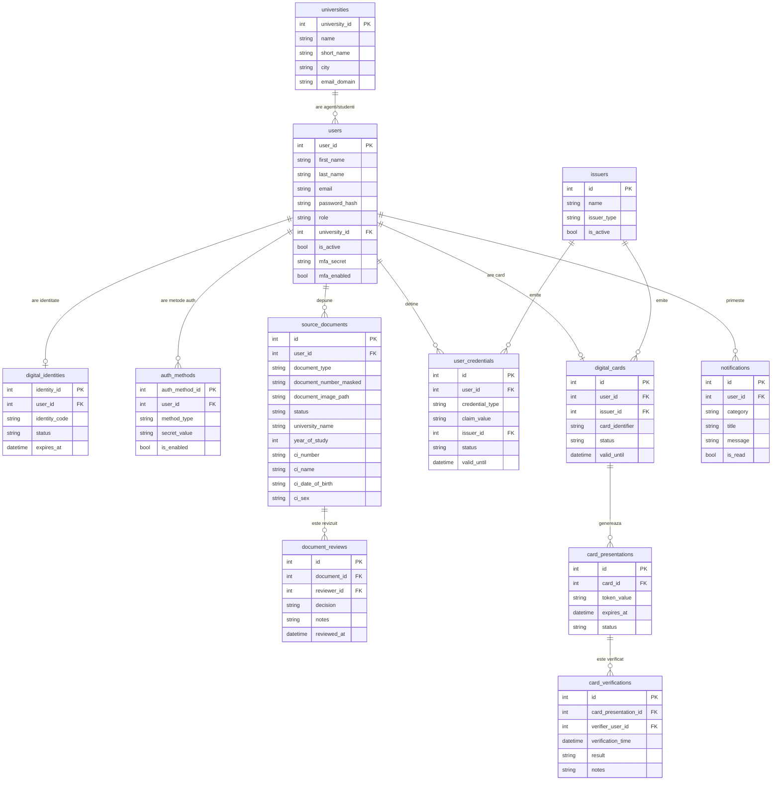

# Modelul de Date — Diagrama Entitate-Relație

## Diagrama completă

---

## Descrierea entităților principale

### `users`
Entitate centrală. Roluri posibile: `passenger`, `conductor`, `admin`, `university_agent`.
Câmpul `university_id` leagă studenții și agenții de universitatea lor.

### `source_documents`
Stochează cererea de verificare identitate depusă de student. Include:
- datele extrase automat din CI prin OCR MRZ (`ci_number`, `ci_name`, `ci_date_of_birth`, `ci_sex`)
- poza legitimației de student
- universitatea și anul de studiu

### `user_credentials`
Credentialele emise după aprobarea documentelor. Tipuri: `identity_verified`, `student_verified`.
Valabilitate limitată (implicit 1 an).

### `digital_cards`
Cardul digital emis utilizatorului după ce are cel puțin o credentiala activă.
Un utilizator → un singur card activ.

### `card_presentations`
Token-uri QR temporare (120 secunde) generate de pasager pentru prezentare în tren.
Fiecare scanare creează o înregistrare în `card_verifications`.

### `universities`
Universități partenere înregistrate în sistem. Agenții universitari sunt legați de o universitate
și văd doar cererile studenților de la acea universitate.

---

## Normalizare

Schema respectă **Forma Normală 3 (3NF)**:
- Fără dependențe tranzitive
- Fiecare atribut depinde doar de cheia primară
- Relații N:M descompuse prin tabele intermediare
