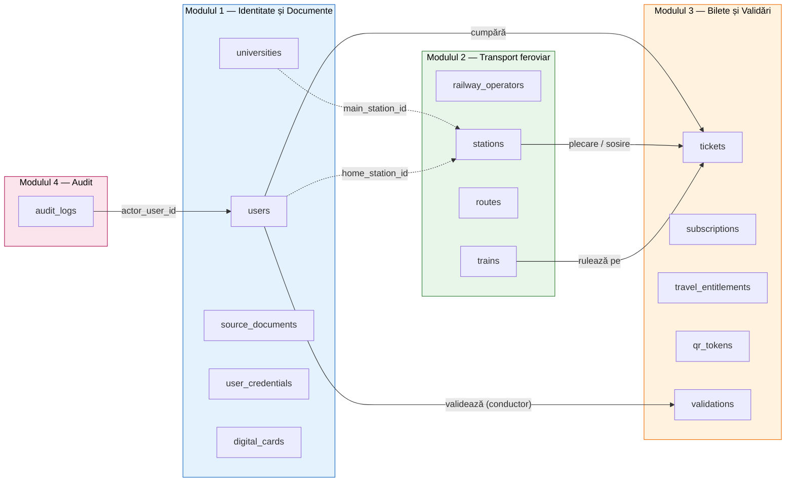
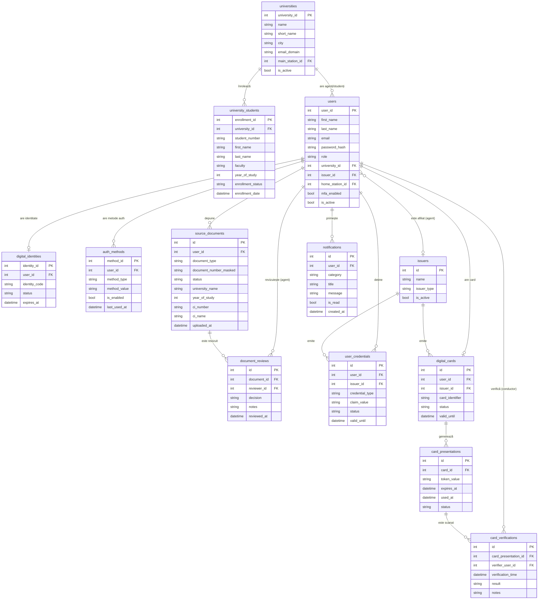
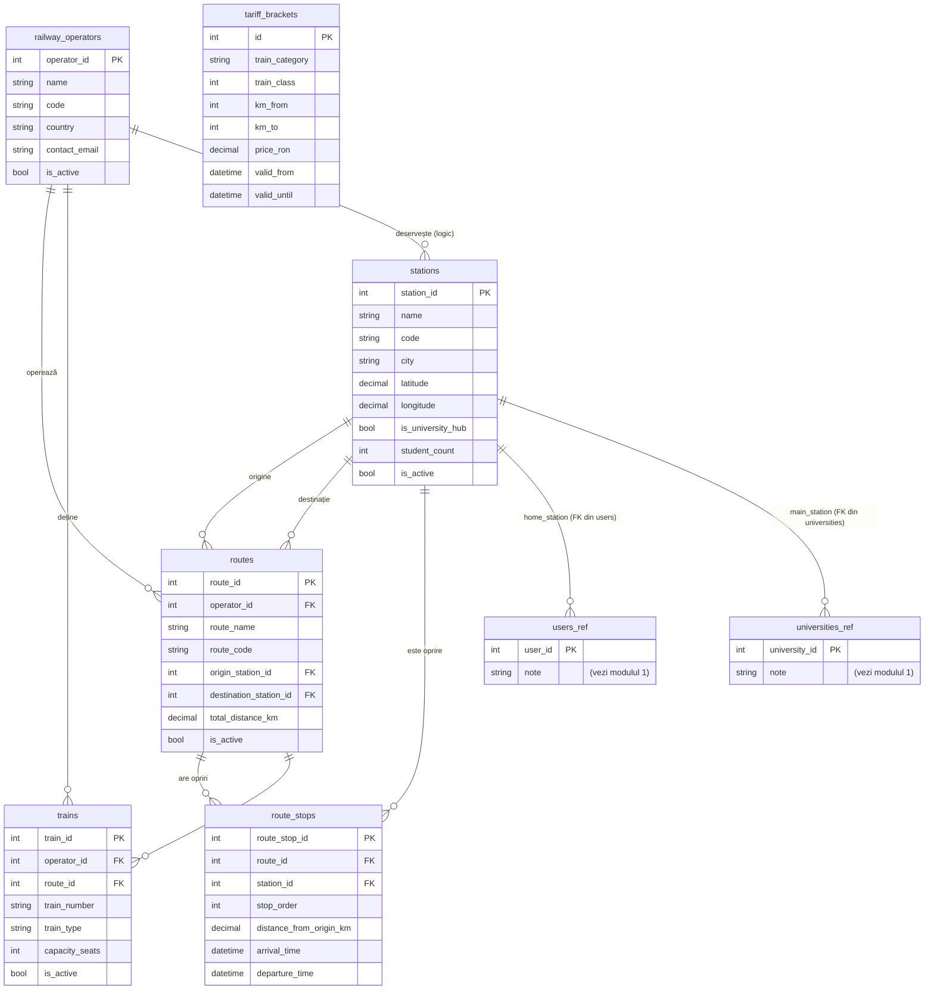
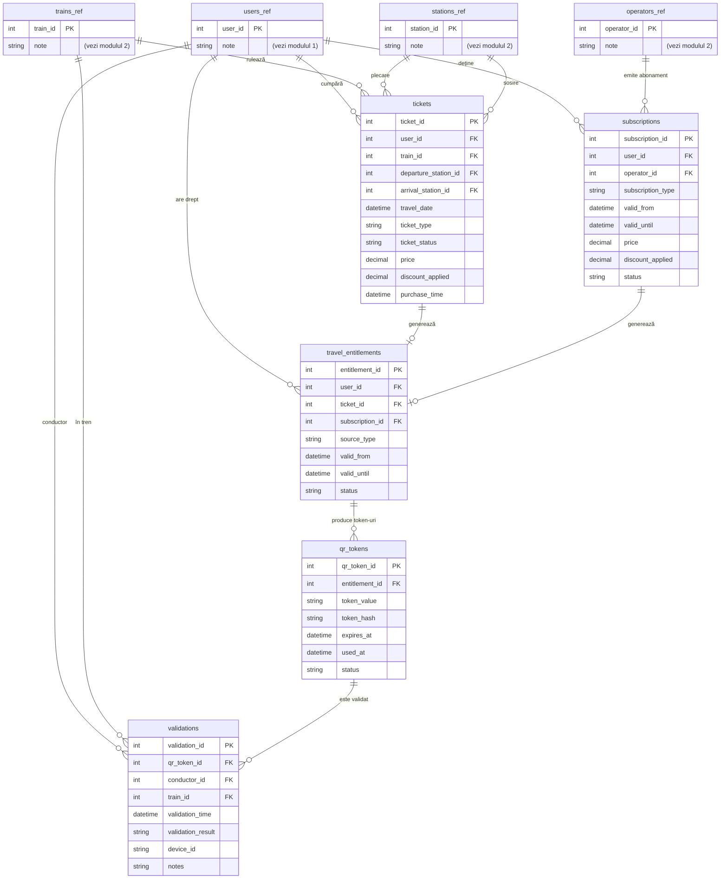
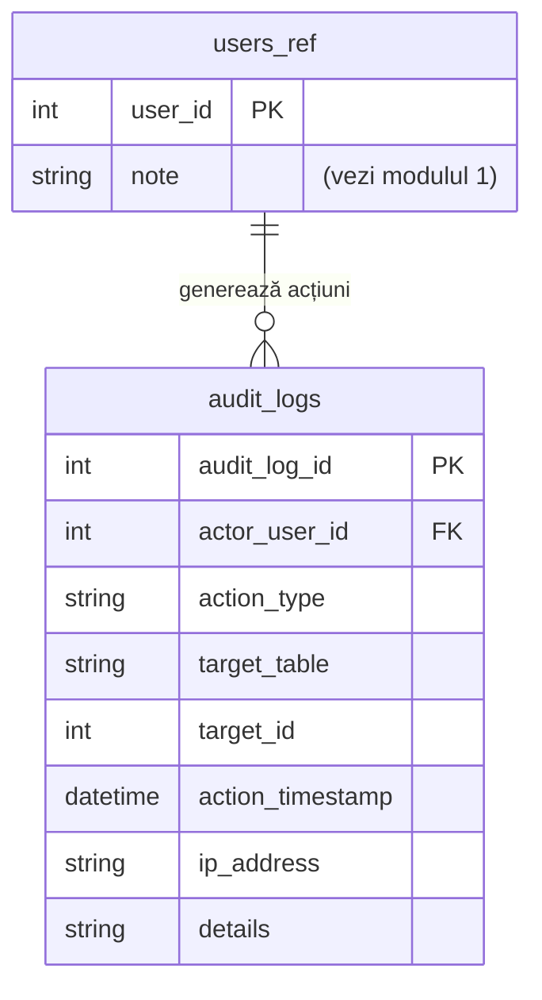

# Modelul de Date — Diagrama Entitate-Relație

## Diagramă de ansamblu (4 module)

> Schema reală conține **25 de tabele**, distribuite logic în cele 4 module de mai sus. Diagramele detaliate urmează pe module pentru lizibilitate.

---

## Modulul 1 — Identitate și Documente

---

## Modulul 2 — Transport feroviar

> Notă: `tariff_brackets` nu are FK direct către `trains` — este o tabelă de lookup, joinul se face în aplicație după `train_type → train_category` și distanța în km calculată din `route_stops`.

---

## Modulul 3 — Bilete și Validări

---

## Modulul 4 — Audit

---

## Descrierea entităților principale

### Modulul 1 — Identitate

#### `users`
Entitate centrală. Roluri posibile: `passenger`, `conductor`, `admin`, `university_agent`.
Câmpul `university_id` leagă studenții și agenții de universitatea lor, iar `home_station_id`
stabilește stația de domiciliu pentru calculul reducerii de 90% (OUG 11/2024).

#### `universities` & `university_students`
Universități partenere și baza locală de studenți înscriși. Agenții universitari văd doar cererile
studenților de la propria universitate. `main_station_id` indică stația centrului universitar.

#### `source_documents`
Cererea de verificare identitate (CI + legitimație). Include date extrase automat prin OCR/MRZ
(`ci_number`, `ci_name`, `ci_date_of_birth`, `ci_sex`, `ci_address`) și statusul fluxului
(`pending` / `approved` / `rejected`).

#### `document_reviews`
Log de aprobări/respingeri ale documentelor de către agenți universitari (audit per decizie).

#### `user_credentials`
Claim-uri verificabile emise după aprobare: `identity_verified`, `student_verified`,
`elev_verified` etc. Au valabilitate limitată (implicit 1 an).

#### `digital_cards`
Cardul digital unic per utilizator, emis după ce există cel puțin o credențială activă.
Relație 1:1 cu `users`.

#### `card_presentations` & `card_verifications`
Token-uri QR efemere (≈120s) generate de pasager pentru a-și prezenta identitatea, respectiv
log-ul scanărilor făcute de conductor (anti-replay).

#### `digital_identities` / `auth_methods` / `issuers` / `notifications`
Entități de suport: identitate conceptuală, metode de autentificare (parolă, TOTP, OTP),
autorități emitente (universități, autoritate feroviară) și notificări in-app.

### Modulul 2 — Transport feroviar

#### `railway_operators`
Operatorii feroviari (ex. CFR Călători, Softrans, Regio Călători). Cheie naturală: `code`.

#### `stations`
Stații feroviare cu coordonate GPS și metadate de tip „hub universitar” (folosite de
endpointurile `/map/*`). `is_university_hub` marchează stațiile principale ale centrelor
universitare.

#### `routes` & `route_stops`
Rute definite prin stația de origine, destinație și un lanț ordonat de opriri intermediare
(`route_stops.stop_order`) cu distanțe kilometrice cumulative — necesare la calculul prețului.

#### `trains`
Trenurile fizice, asociate unui operator și unei rute. Tipul (`regio`, `interregio`, `intercity`,
`express`, `high_speed`) determină categoria tarifară.

#### `tariff_brackets`
Tabelă lookup cu prețuri pe trepte de distanță (aproximează „Tariful 100” CFR). Joinul cu
trenurile se face în aplicație după (categorie, clasă, km).

### Modulul 3 — Bilete și Validări

#### `tickets`
Bilete individuale (`single`, `return`, `group`) cu preț, reducere aplicată și stații de
plecare/sosire. FK-uri către `users`, `trains`, `stations`.

#### `subscriptions`
Abonamente (`monthly`, `semester`, `annual`, `weekly`) emise de un operator, cu interval de
valabilitate și status (`active` / `expired` / `cancelled` / `suspended`).

#### `travel_entitlements`
Tabela unificatoare a drepturilor de călătorie. Un drept provine fie dintr-un `ticket`, fie
dintr-un `subscription`, fie dintr-un `benefit` (CHECK garantează exclusivitate). Permite
generarea uniformă de QR-uri pentru ambele tipuri.

#### `qr_tokens`
Token-uri QR single-use emise pentru un drept de călătorie. Stochează atât `token_value`
(payload semnat) cât și `token_hash` (pentru lookup rapid și anti-replay).

#### `validations`
Log-ul scanărilor făcute de conductor în tren. Reține rezultatul (`valid` / `invalid` /
`expired` / `already_used`), trenul, dispozitivul și conductorul care a scanat.

### Modulul 4 — Audit

#### `audit_logs`
Log cross-cutting pentru acțiuni sensibile: emitere credențiale, aprobare documente,
revocare card, validare bilete etc. Reține actorul (`actor_user_id`), tipul acțiunii, tabela și
ID-ul țintă, IP și un câmp liber `details` (JSON serializat sau text).

---

## Normalizare

Schema respectă **Forma Normală 3 (3NF)**: **25 de tabele organizate în 4 module logice**
(Identitate & Documente, Transport feroviar, Bilete & Validări, Audit), fără dependențe
tranzitive și cu fiecare atribut non-cheie depinzând exclusiv de cheia primară. Relațiile N:M
sunt descompuse prin tabele intermediare (`route_stops`, `travel_entitlements`), iar câmpurile
denormalizate intenționat (ex. `users.university_name`, `source_documents.university_name`)
sunt documentate explicit ca optimizări pentru filtrare fără JOIN.
