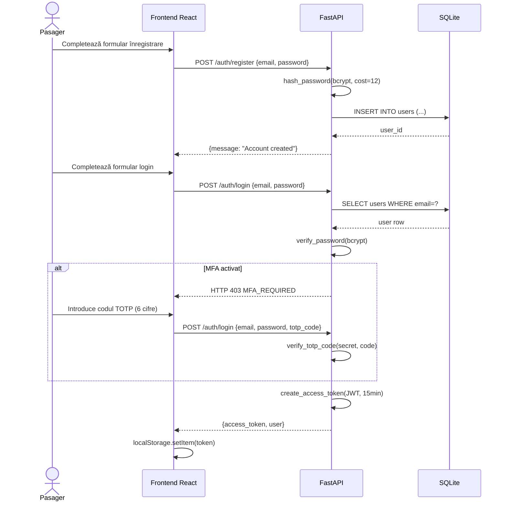
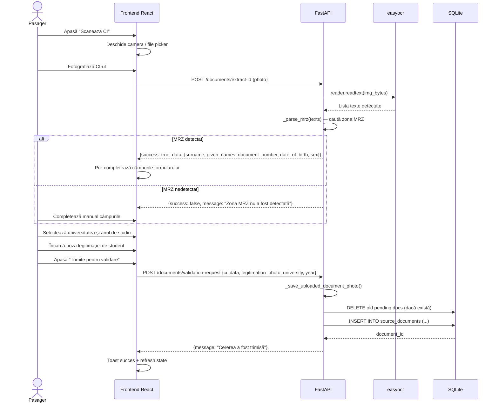
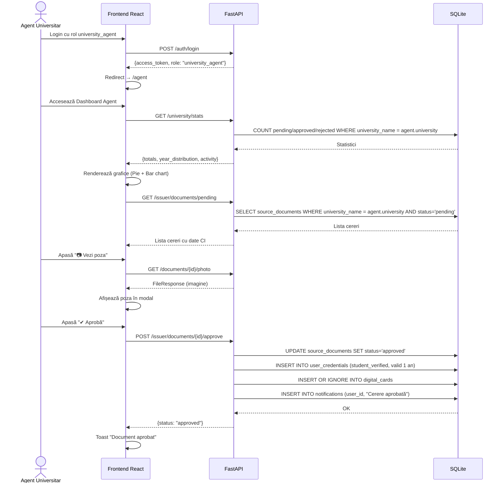
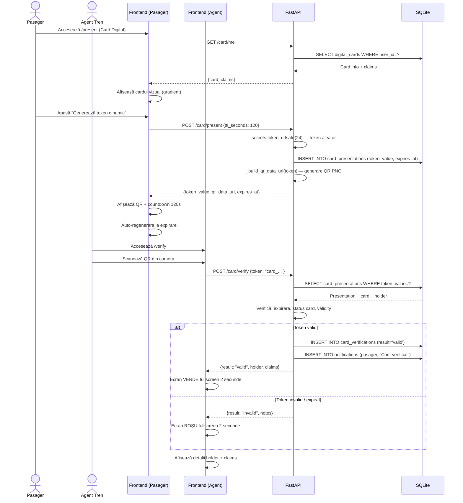
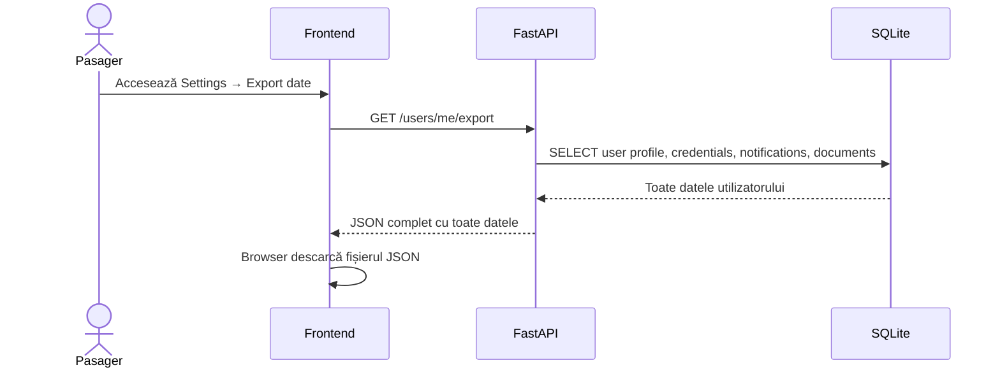

# Diagrame de Secvență — Fluxuri principale

## 1. Flux: Înregistrare și autentificare cu MFA

---

## 2. Flux: Depunere documente cu OCR

---

## 3. Flux: Verificare și aprobare de către agentul universitar

---

## 4. Flux: Generare și verificare card digital

---

## 5. Flux: Export date GDPR

