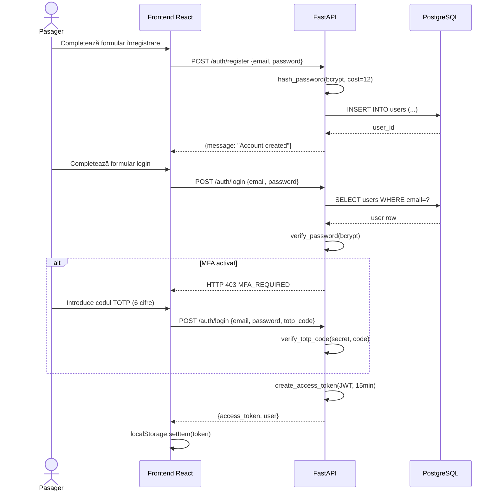
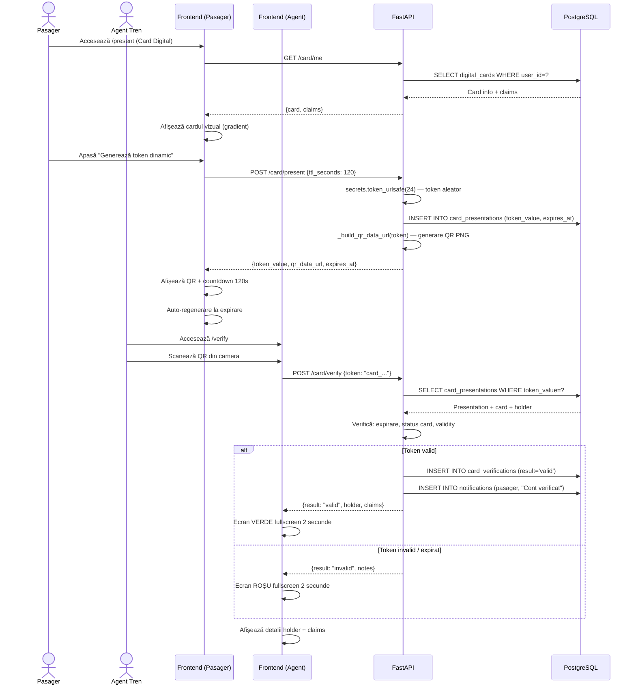
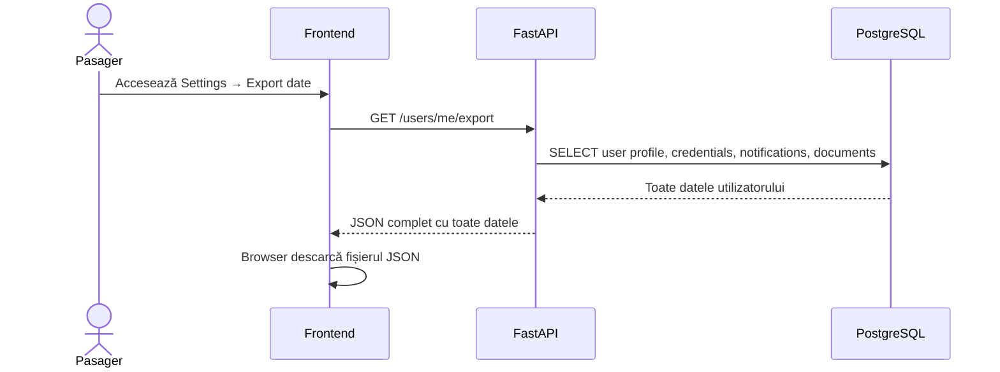
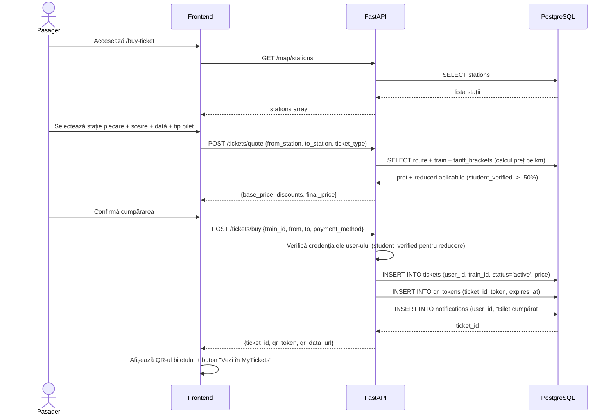
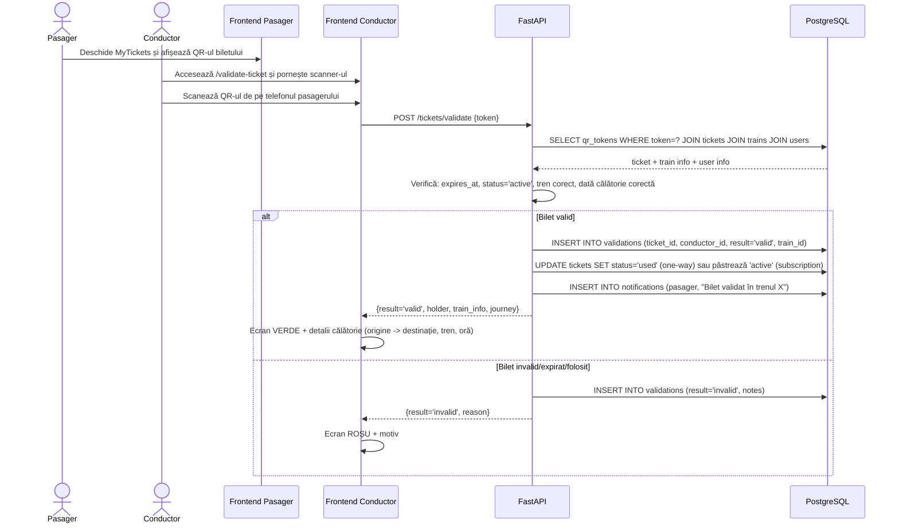
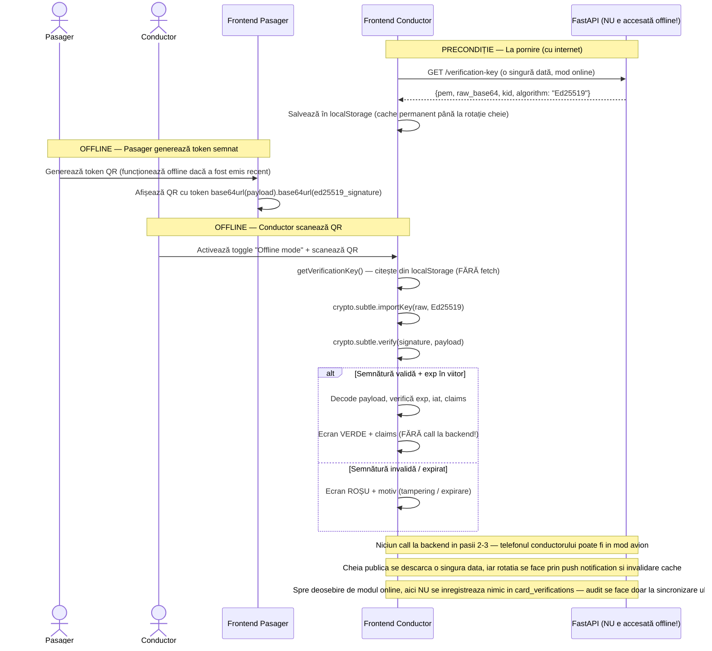

# Diagrame de Secvență — Fluxuri principale

## 1. Flux: Înregistrare și autentificare cu MFA

---

## 2. Flux: Depunere documente cu OCR

---

## 3. Flux: Verificare și aprobare de către agentul universitar

---

## 4. Flux: Generare și verificare card digital

---

## 5. Flux: Export date GDPR

---

## 6. Flux: Cumpărare bilet de tren

---

## 7. Flux: Validare bilet în tren (de către conductor)

---

## 8. Flux: Verificare offline a cardului digital (Ed25519 fără internet)

> **NOTĂ:** Acest flux ilustrează cum sistemul funcționează FĂRĂ conexiune la internet pentru conductor.

