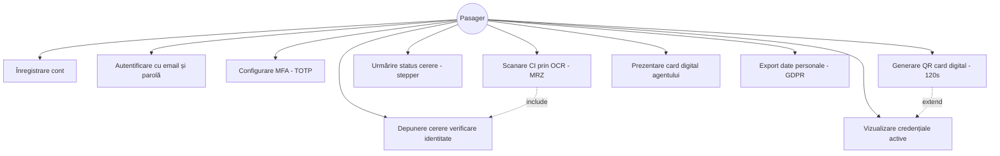
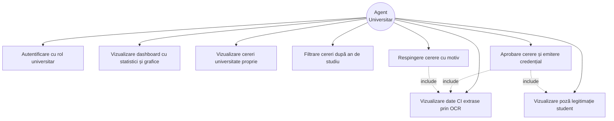
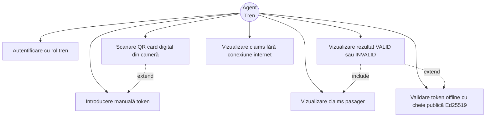
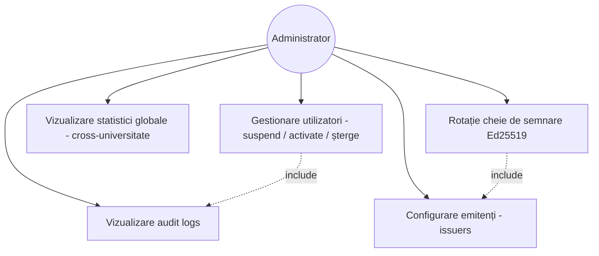

# Diagrame Use Case

## Actori

| Actor | Descriere |
|-------|-----------|
| **Pasager (Student)** | Utilizatorul care depune documente și folosește cardul digital |
| **Agent Universitar** | Verifică și aprobă/respinge cererile studenților universității sale și emite credențiale |
| **Agent Tren** | Scanează cardul digital al pasagerului în tren |
| **Administrator** | Operator de sistem: gestionează utilizatori, vede audit logs, monitorizează statistici globale. |

---

## UC1 — Pasager (Student)



---

## UC2 — Agent Universitar



---

## UC3 — Agent Tren



---

## UC4 — Administrator



---

## UC5 — Pasager (Modul Transport)


---

## Descriere use case-uri principale

### UC5 — Depunere cerere verificare identitate
- **Actor principal:** Pasager
- **Precondiție:** Utilizator autentificat
- **Flux:** Scanează CI cu OCR → datele se completează automat → încarcă poza legitimației → selectează universitatea și anul → trimite cererea
- **Postcondiție:** Cerere în status `pending`, vizibilă agentului universitar

### UC17 — Aprobare cerere și emitere credențial
- **Actor principal:** Agent Universitar
- **Precondiție:** Există cereri `pending` pentru universitatea agentului
- **Flux:** Vizualizează datele CI + poza legitimației → verifică datele → aprobă
- **Postcondiție:** Se emite automat un `user_credential` de tip `student_verified`; pasagerul primește notificare și poate genera cardul digital

### UC20 — Scanare QR card digital
- **Actor principal:** Agent Tren
- **Precondiție:** Pasagerul a generat un QR activ (valabil 120 secunde)
- **Flux:** Agent scanează QR → sistemul validează token-ul → afișează ecran VERDE/ROȘU + claims
- **Postcondiție:** Validare înregistrată în `card_verifications`; pasagerul primește notificare

### UC25 — Gestionare utilizatori
- **Actor principal:** Administrator
- **Precondiție:** Administrator autentificat cu rol `admin`
- **Flux:** Vizualizează lista utilizatorilor → filtrează după status/rol → selectează un utilizator → execută acțiune (suspend / activate / șterge) → confirmă operația → sistemul scrie o intrare în audit log
- **Postcondiție:** Starea utilizatorului este actualizată; sesiunile active sunt invalidate la suspend/ștergere; acțiunea este trasabilă în `audit_logs`

### UC28 — Rotație cheie de semnare Ed25519
- **Actor principal:** Administrator
- **Precondiție:** Există o cheie Ed25519 activă pentru un issuer configurat
- **Flux:** Selectează issuer-ul → declanșează generarea unei noi perechi de chei Ed25519 → noua cheie publică este publicată în JWKS → cheia veche este marcată `rotated` (păstrată pentru verificarea tokenilor existenți până la expirare) → noile credențiale sunt semnate cu cheia nouă
- **Postcondiție:** Issuer-ul are o cheie activă nouă; cheia veche rămâne validă doar pentru verificare; evenimentul este înregistrat în audit logs

### UC31 — Cumpărare bilet
- **Actor principal:** Pasager
- **Precondiție:** Pasager autentificat; opțional are card digital activ pentru reducere studențească
- **Flux:** Caută stația de origine și destinație → vizualizează ruta pe harta feroviară live → selectează trenul și clasa → sistemul detectează automat dacă pasagerul are card digital activ și aplică reducerea → confirmă și plătește biletul
- **Postcondiție:** Biletul este emis și salvat în `tickets`; pasagerul primește un QR de validare; biletul apare în lista „Bilete cumpărate"

### UC33 — Validare bilet în tren
- **Actor principal:** Pasager
- **Precondiție:** Pasager are cel puțin un bilet activ pentru cursa curentă
- **Flux:** Deschide aplicația → accesează „Bilete cumpărate" → afișează QR-ul sau token-ul biletului → agentul tren scanează → sistemul verifică semnătura și valabilitatea biletului → afișează VALID/INVALID
- **Postcondiție:** Biletul este marcat ca `validated`; călătoria intră în istoric (UC34)

### UC36 — Validare token offline (Agent Tren)
- **Actor principal:** Agent Tren
- **Precondiție:** Aplicația agentului are cheia publică Ed25519 a issuer-ului cache-uită local (descărcată din JWKS la ultima conexiune online)
- **Flux:** Agent scanează QR-ul / introduce token-ul → aplicația verifică semnătura JWS local, în browser, folosind **Web Crypto API (algoritm Ed25519)** → validează `exp`, `nbf`, `iss` și `aud` fără apel la server → afișează rezultatul VALID/INVALID și claims-urile pasagerului
- **Postcondiție:** Validarea este efectuată complet offline; rezultatul și claims-urile sunt vizibile agentului; evenimentul de validare este pus într-o coadă locală și sincronizat în `card_verifications` la reconectare

### UC41 - Selectare loc în vagon (real-time)

**Actor:** Pasager

**Precondiții:** Pasagerul este în procesul de cumpărare a unui bilet și a selectat
un tren și o dată.

**Flux:**
1. Sistemul afișează harta vagoanelor trenului (Regio=3 vagoane, IR=5, IC=7,
   fiecare cu 60 locuri în layout 2+2 cu culoar central).
2. Fiecare loc are status vizual: liber (alb), selecția ta (galben), vândut
   (roșu), hold de alt user (portocaliu), deja cumpărat de tine (albastru).
3. Pasagerul face click pe un loc liber.
4. Sistemul ține locul rezervat 5 minute (`seat_reservations` cu `expires_at`).
5. Pe alte device-uri (alți pasageri), locul apare ca portocaliu (indisponibil).
6. La click din nou pe locul propriu, hold-ul este eliberat (toggle).
7. La confirmarea cumpărării (UC31), hold-ul devine vânzare (`ticket_seats`).
8. Dacă nu confirmă în 5 minute, hold-ul expiră automat și locul redevine liber.

**Postcondiții:** Locul este marcat ca vândut pentru data și trenul respective.
Schimbările sunt vizibile live (polling 5s) pentru ceilalți useri.

---

### UC42 - Anulare bilet cu refund pe trepte CFR

**Actor:** Pasager

**Precondiții:** Pasagerul are un bilet activ ne-utilizat (`ticket_status='active'`).

**Flux:**
1. Pasagerul deschide pagina "Biletele mele" și apasă "Anulare" pe un bilet activ.
2. Modal de confirmare afișează refund-ul estimat conform regulamentului CFR:
   - **>24h** înainte de plecare: 100% refund
   - **1m - 24h** înainte de plecare: 50% refund
   - **0** sau după plecare: 0% refund (nu se acordă)
3. Pasagerul confirmă.
4. Sistemul:
   - Marchează biletul `cancelled` + populează `cancel_refund_amount`
   - Eliberează instantaneu locul (șterge `ticket_seats`) — alți pasageri pot
     cumpăra același loc imediat.
   - Invalidează `travel_entitlements` și `qr_tokens` asociate
   - Creează notificare cu suma de refund
5. Răspuns: `{refund_amount, refund_tier, seats_released}`

**Postcondiții:** Biletul rămâne vizibil în istoric cu status "Anulat" și suma
refund. Locul este disponibil pentru reluarea vânzării.

---

### UC43 - Reprogramare bilet (același traseu, alt tren / dată)

**Actor:** Pasager

**Precondiții:** Bilet activ, trenul nu a plecat încă, există alte trenuri pe
același traseu.

**Flux:**
1. Pasagerul apasă "Reprogramare" pe bilet.
2. Modal cu selector dată + listă trenuri disponibile pe același origin/destination.
3. Pasagerul alege noul tren + (opțional) locuri noi prin SeatMap.
4. Sistemul validează:
   - Trenul nou este pe **același traseu** (`origin_station_id` și
     `destination_station_id` identice) — altfel 409 `different_route`.
   - Noul interval orar nu se suprapune cu alte bilete active ale userului.
   - Trenul nu a plecat încă.
5. Tranzacție atomică:
   - Eliberează locurile vechi
   - Marchează biletul vechi `rescheduled` (cu link la cel nou)
   - Creează bilet nou clonat (același preț, traseu, tip), legat invers
   - Mută `travel_entitlements` pe biletul nou
   - Notificare

**Postcondiții:** Lanț `rescheduled_from_ticket_id` <-> `rescheduled_to_ticket_id`
trasabil. **Diferența de preț nu se restituie** (regulă CFR).

---

### UC44 - Anti-overlap intervale orare

**Tip:** Constrângere de business aplicată la UC31 (cumpărare) și UC43
(reprogramare).

**Regulă:** Un user nu poate avea simultan două bilete active în intervale orare
suprapuse, indiferent de tren sau traseu.

**Algoritm:**
1. Calculează intervalul `[new_dep, new_arr]` pentru noul tren + dată
   (din `route_stops` prima și ultima oprire pe rută).
2. Selectează biletele active ale userului din `travel_date +/- 1 zi`
   (acoperă și trenurile de noapte care trec peste miezul nopții).
3. Pentru fiecare bilet existent, calculează `[ex_dep, ex_arr]`.
4. Dacă `new_dep < ex_arr AND ex_dep < new_arr` -> **conflict**.
5. Răspunde 409 cu detalii: trenul în conflict, intervalul lui, ID-ul biletului.

**Justificare:** Pasagerul fizic nu poate fi în două trenuri în același timp.
Această regulă previne și fraudele de tip "rezervare multiplă speculativă"
(blocare locuri în trenuri diferite pentru a alege ulterior).

### UC45 - Imutabilitate date validate (Frozen Fields)

**Actor:** Pasager (orice user cu identitate validată).

**Tip:** Constrângere de business cross-cutting pe UC6 (Modificare profil).

**Precondiții:** Utilizatorul are credential `identity_verified` activ
(emis de un agent universitar, neexpirat).

**Regulă:** Următoarele câmpuri NU pot fi modificate până la expirarea
credentialului:

- `cnp` (Cod Numeric Personal)
- `first_name`, `last_name`
- `birth_date`
- `home_station_id` (stația de domiciliu, derivată din adresa validată)

**Expirare:** Credentialul `identity_verified` are `valid_until = 1 oct
al anului universitar curent`. Logică:

- Dacă verificarea s-a făcut între 1 ian și 30 sep -> expiră pe 1 oct anul curent.
- Dacă verificarea s-a făcut între 1 oct și 31 dec -> expiră pe 1 oct anul următor.

**Flux la modificare:**

1. Utilizatorul trimite `PATCH /users/me` cu un câmp FROZEN modificat.
2. Sistemul:
   - Verifică `is_identity_verified(user_id)` -> True.
   - Compară fiecare câmp FROZEN din payload cu valoarea curentă din DB.
   - Dacă există delta -> răspunde **HTTP 403** cu detalii:
     ```json
     {
       "error": "frozen_field_modification_blocked",
       "frozen_fields_attempted": ["cnp"],
       "expires_at": "2026-10-01",
       "days_until_expiry": 115,
       "message": "Nu puteți modifica câmpurile [\"cnp\"] cât timp
                   identitatea este verificată. Verificarea expiră pe 2026-10-01."
     }
     ```
3. Frontend (Profile.jsx):
   - Apelează `GET /users/me/verification-status` la mount.
   - Dacă `is_verified=true`, afișează banner sus cu data expirării.
   - Marchează input-urile FROZEN cu icon 🔒 și atribut `disabled`.
   - Secțiunea "Rută personală" devine read-only.

**Postcondiții:** Datele validate rămân intacte. La 1 oct, credentialul
expiră automat (lazy cleanup în `get_verification_status()`), iar
câmpurile redevin editabile. Utilizatorul trebuie să reîncarce
documentele și să fie re-aprobat de agent pentru a primi un nou card.

**Justificare:** Previne **identity laundering** — un atacator cu acces
la cont nu poate transfera statusul "verificat" către date frauduloase
(CNP/nume schimbat). Verificarea rămâne ancorată în actele fizice
inspectate de agent.

**Acoperire de teste:** 17 teste integration în
`tests/integration/test_profile_freeze.py` (TestAcademicYearBoundary,
TestUnverifiedUserCanModifyEverything, TestVerifiedUserCannotModifyFrozenFields,
TestExpiredVerificationUnlocksFields, TestVerificationStatusEndpoint).

### UC46 - Cumpărare abonament CFR cu scope pe rută

**Actor:** Pasager (cu sau fără identitate verificată).

**Precondiții:**
- User autentificat
- Stațiile de plecare și sosire există
- User nu are deja un abonament `active` pe aceeași rută (în nicio direcție)

**Flux principal:**

1. Pasagerul deschide **Abonamente** -> click "Cumpără abonament nou".
2. Selectează stația de plecare + stația de sosire (typeahead live cu `/stations/search`).
3. Selectează tip: `monthly` sau `annual`.
4. La fiecare schimbare, frontend-ul cere live un quote via `POST /subscriptions/quote`:
   - Backend calculează distanța din `routes.total_distance_km` (fallback: haversine din coordonate)
   - Aplică formula: `base = (distance * 0.5 + 50) * type_multiplier`
   - Verifică dacă userul are credential `student_verified` activ
   - Verifică dacă ruta selectată = `home_station ↔ university_station` (regulă UC40/OUG 11/2024)
   - Dacă DA: aplică reducere 90% (OUG 11/2024). Altfel: preț întreg.
   - Returnează `{base_price, discount_amount, discount_pct, final_price, is_student_route, discount_reason}`
5. Pasagerul vede prețul + motivul reducerii (sau lipsa ei) și confirmă.
6. `POST /subscriptions/buy`:
   - Re-verifică anti-overlap (`check_subscription_overlap`)
   - Inserează abonament cu `subscription_scope='route'`, `status='active'`
   - Generează notificare confirmare
7. Pasagerul este redirecționat către lista de abonamente, cu toast confirmare.

**Postcondiții:**
- Abonament `active` în DB cu `valid_from` = azi, `valid_until` = azi + 30 sau 365 zile
- Toate biletele cumpărate pe ruta acoperită devin automat gratuite (vezi UC47)

**Erori posibile:**

- `400` — stația plecare == sosire / format invalid
- `400` — distanța indisponibilă (stații fără coordonate)
- `409 subscription_overlap` — există deja abonament activ pe rută
- `401` — token absent/invalid

---

### UC47 - Bilet gratuit via abonament activ

**Actor:** Pasager cu abonament `active` pe ruta selectată.

**Tip:** Extindere a UC31 (Cumpărare bilet) — se declanșează automat la `/tickets/buy`.

**Flux:**

1. Pasagerul completează formularul de cumpărare bilet ca de obicei (tren, stații, dată, tip).
2. Frontend-ul detectează prin `getMySubscriptions()` dacă există abonament `active` care:
   - Are `subscription_scope='route'`
   - Acoperă ruta selectată (în orice direcție)
   - Are `valid_from <= travel_date <= valid_until`
3. Dacă DA, **banner verde** în pagina BuyTicket:
   > "Acoperit de abonament. Biletul va fi GRATUIT (0 RON)."
4. La confirmare, `POST /tickets/buy`:
   - Backend apelează `find_active_subscription_for_route(user, from, to, date)` după anti-overlap check
   - Dacă există match -> după INSERT-ul ticketului, face UPDATE: `price=0, discount_applied=100, uses_subscription_id=N`
   - Restul flow-ului (entitlement, qr_token, seat confirmation) rămâne neschimbat
5. Biletul rezultat este vizibil în **Biletele mele** cu preț 0 RON și poate fi validat în tren ca orice alt bilet.

**Postcondiții:**
- Bilet cu `price=0`, `uses_subscription_id` populat (audit trail)
- QR token valid pentru validare în tren
- Abonamentul rămâne neschimbat (nu se decrementează nr de călătorii — sistem nelimitat în implementarea curentă)

**Reguli speciale:**

- **Anti-overlap normal se aplică**: chiar dacă biletul e gratuit, dacă userul are alt bilet activ în același interval orar, primește 409 (regulă UC44).
- Dacă abonamentul expiră între `travel_date` cumpărare și data reală de călătorie, biletul rămâne valid (era valid la momentul cumpărării).
- Anularea biletului cumpărat via abonament nu dă refund (preț=0) dar eliberează locurile rezervate.

**Acoperire teste:**

- `test_ticket_on_covered_route_is_free` — confirmă DB: price=0 + uses_subscription_id
- `test_ticket_on_uncovered_route_has_normal_price` — confirmă că abonamentul pe ruta A nu afectează biletul pe ruta B
