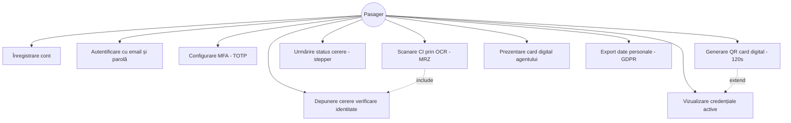
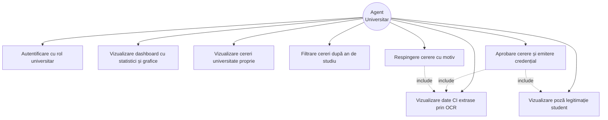
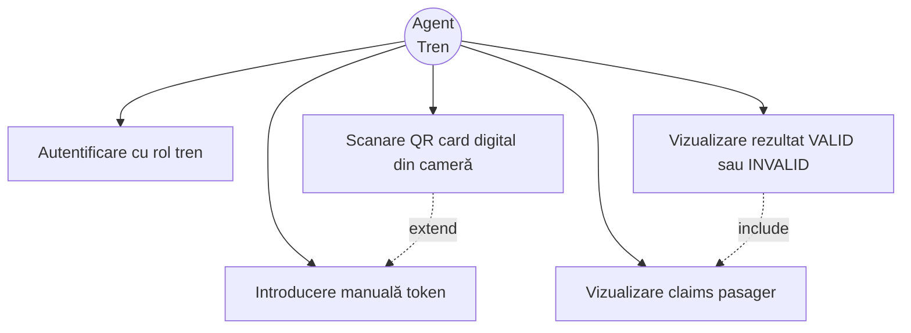

# Diagrame Use Case

## Actori

| Actor | Descriere |
|-------|-----------|
| **Pasager (Student)** | Utilizatorul care depune documente și folosește cardul digital |
| **Agent Universitar** | Verifică și aprobă/respinge cererile studenților universității sale și emite credențiale |
| **Agent Tren** | Scanează cardul digital al pasagerului în tren |

---

## UC1 — Pasager (Student)

---

## UC2 — Agent Universitar

---

## UC3 — Agent Tren

---

## Descriere use case-uri principale

### UC5 — Depunere cerere verificare identitate
- **Actor principal:** Pasager
- **Precondiție:** Utilizator autentificat
- **Flux:** Scanează CI cu OCR → datele se completează automat → încarcă poza legitimației → selectează universitatea și anul → trimite cererea
- **Postcondiție:** Cerere în status `pending`, vizibilă agentului universitar

### UC17 — Aprobare cerere și emitere credențial
- **Actor principal:** Agent Universitar
- **Precondiție:** Există cereri `pending` pentru universitatea agentului
- **Flux:** Vizualizează datele CI + poza legitimației → verifică datele → aprobă
- **Postcondiție:** Se emite automat un `user_credential` de tip `student_verified`; pasagerul primește notificare și poate genera cardul digital

### UC20 — Scanare QR card digital
- **Actor principal:** Agent Tren
- **Precondiție:** Pasagerul a generat un QR activ (valabil 120 secunde)
- **Flux:** Agent scanează QR → sistemul validează token-ul → afișează ecran VERDE/ROȘU + claims
- **Postcondiție:** Validare înregistrată în `card_verifications`; pasagerul primește notificare
