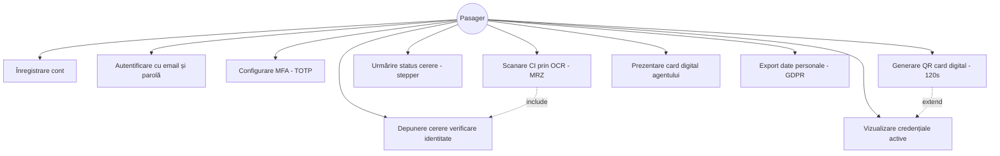
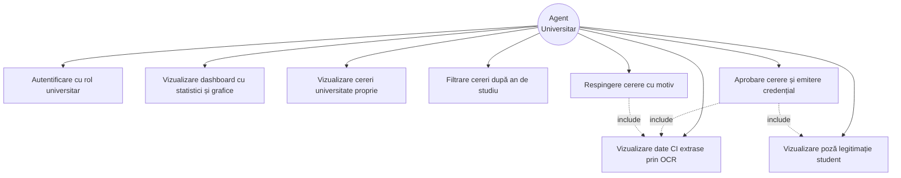
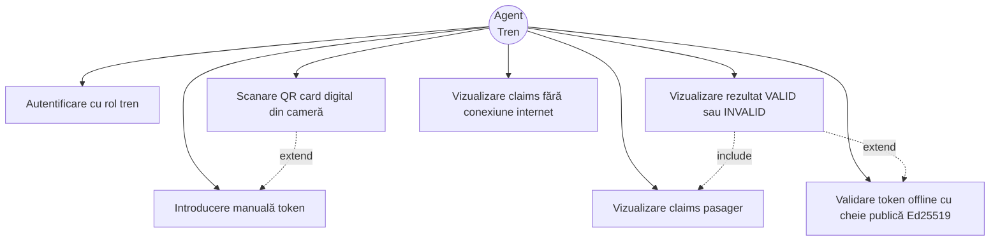
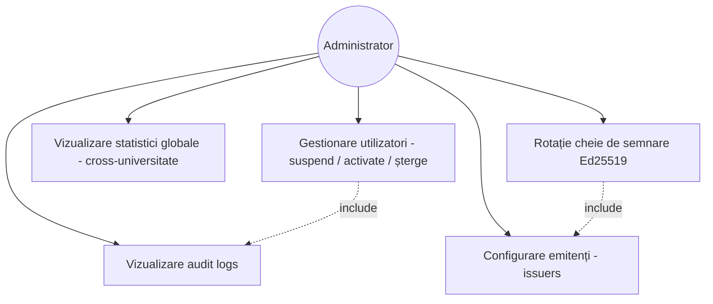
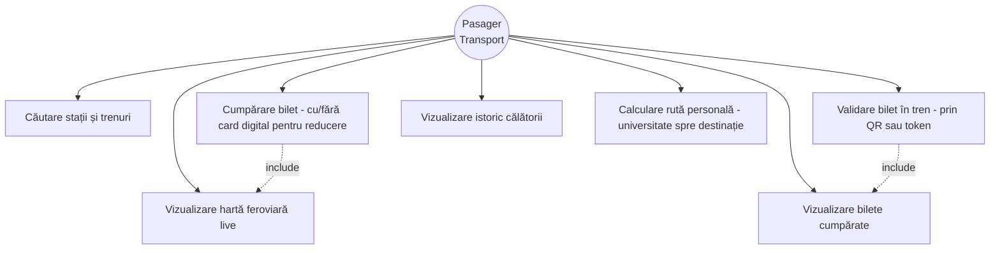

# Diagrame Use Case

## Actori

| Actor | Descriere |
|-------|-----------|
| **Pasager (Student)** | Utilizatorul care depune documente și folosește cardul digital |
| **Agent Universitar** | Verifică și aprobă/respinge cererile studenților universității sale și emite credențiale |
| **Agent Tren** | Scanează cardul digital al pasagerului în tren |
| **Administrator** | Operator de sistem: gestionează utilizatori, vede audit logs, monitorizează statistici globale. |

---

## UC1 — Pasager (Student)

---

## UC2 — Agent Universitar

---

## UC3 — Agent Tren

---

## UC4 — Administrator

---

## UC5 — Pasager (Modul Transport)

---

## Descriere use case-uri principale

### UC5 — Depunere cerere verificare identitate
- **Actor principal:** Pasager
- **Precondiție:** Utilizator autentificat
- **Flux:** Scanează CI cu OCR → datele se completează automat → încarcă poza legitimației → selectează universitatea și anul → trimite cererea
- **Postcondiție:** Cerere în status `pending`, vizibilă agentului universitar

### UC17 — Aprobare cerere și emitere credențial
- **Actor principal:** Agent Universitar
- **Precondiție:** Există cereri `pending` pentru universitatea agentului
- **Flux:** Vizualizează datele CI + poza legitimației → verifică datele → aprobă
- **Postcondiție:** Se emite automat un `user_credential` de tip `student_verified`; pasagerul primește notificare și poate genera cardul digital

### UC20 — Scanare QR card digital
- **Actor principal:** Agent Tren
- **Precondiție:** Pasagerul a generat un QR activ (valabil 120 secunde)
- **Flux:** Agent scanează QR → sistemul validează token-ul → afișează ecran VERDE/ROȘU + claims
- **Postcondiție:** Validare înregistrată în `card_verifications`; pasagerul primește notificare

### UC25 — Gestionare utilizatori
- **Actor principal:** Administrator
- **Precondiție:** Administrator autentificat cu rol `admin`
- **Flux:** Vizualizează lista utilizatorilor → filtrează după status/rol → selectează un utilizator → execută acțiune (suspend / activate / șterge) → confirmă operația → sistemul scrie o intrare în audit log
- **Postcondiție:** Starea utilizatorului este actualizată; sesiunile active sunt invalidate la suspend/ștergere; acțiunea este trasabilă în `audit_logs`

### UC28 — Rotație cheie de semnare Ed25519
- **Actor principal:** Administrator
- **Precondiție:** Există o cheie Ed25519 activă pentru un issuer configurat
- **Flux:** Selectează issuer-ul → declanșează generarea unei noi perechi de chei Ed25519 → noua cheie publică este publicată în JWKS → cheia veche este marcată `rotated` (păstrată pentru verificarea tokenilor existenți până la expirare) → noile credențiale sunt semnate cu cheia nouă
- **Postcondiție:** Issuer-ul are o cheie activă nouă; cheia veche rămâne validă doar pentru verificare; evenimentul este înregistrat în audit logs

### UC31 — Cumpărare bilet
- **Actor principal:** Pasager
- **Precondiție:** Pasager autentificat; opțional are card digital activ pentru reducere studențească
- **Flux:** Caută stația de origine și destinație → vizualizează ruta pe harta feroviară live → selectează trenul și clasa → sistemul detectează automat dacă pasagerul are card digital activ și aplică reducerea → confirmă și plătește biletul
- **Postcondiție:** Biletul este emis și salvat în `tickets`; pasagerul primește un QR de validare; biletul apare în lista „Bilete cumpărate”

### UC33 — Validare bilet în tren
- **Actor principal:** Pasager
- **Precondiție:** Pasager are cel puțin un bilet activ pentru cursa curentă
- **Flux:** Deschide aplicația → accesează „Bilete cumpărate” → afișează QR-ul sau token-ul biletului → agentul tren scanează → sistemul verifică semnătura și valabilitatea biletului → afișează VALID/INVALID
- **Postcondiție:** Biletul este marcat ca `validated`; călătoria intră în istoric (UC34)

### UC36 — Validare token offline (Agent Tren)
- **Actor principal:** Agent Tren
- **Precondiție:** Aplicația agentului are cheia publică Ed25519 a issuer-ului cache-uită local (descărcată din JWKS la ultima conexiune online)
- **Flux:** Agent scanează QR-ul / introduce token-ul → aplicația verifică semnătura JWS local, în browser, folosind **Web Crypto API (algoritm Ed25519)** → validează `exp`, `nbf`, `iss` și `aud` fără apel la server → afișează rezultatul VALID/INVALID și claims-urile pasagerului
- **Postcondiție:** Validarea este efectuată complet offline; rezultatul și claims-urile sunt vizibile agentului; evenimentul de validare este pus într-o coadă locală și sincronizat în `card_verifications` la reconectare
