# Diagrama Use Case

## Actori

| Actor | Descriere |
|-------|-----------|
| **Pasager (Student)** | Utilizatorul care depune documente și folosește cardul digital |
| **Agent Universitar** | Verifică și aprobă/respinge cererile studenților universității sale |
| **Agent Tren** | Scanează cardul digital al pasagerului în tren |
| **Issuer Verifier** | Administrator care gestionează toate cererile și emite credențiale |

---

## Diagrama

```mermaid
graph TD
    subgraph Pasager
        UC1[Înregistrare / Autentificare]
        UC2[Configurare MFA - TOTP]
        UC3[Scanare CI prin OCR]
        UC4[Depunere documente - CI + legitimație]
        UC5[Urmărire status cerere - stepper]
        UC6[Vizualizare credențiale active]
        UC7[Generare QR card digital]
        UC8[Export date personale - GDPR]
    end

    subgraph Agent_Universitar["Agent Universitar"]
        UC9[Autentificare cu rol universitar]
        UC10[Vizualizare cereri universitate proprie]
        UC11[Filtrare cereri după an de studiu]
        UC12[Vizualizare date CI extrase - OCR]
        UC13[Vizualizare poză legitimație]
        UC14[Aprobare cerere - emitere credential]
        UC15[Respingere cerere cu motiv]
        UC16[Vizualizare statistici și grafice]
    end

    subgraph Agent_Tren["Agent Tren"]
        UC17[Autentificare cu rol tren]
        UC18[Scanare QR card digital]
        UC19[Vizualizare rezultat VALID / INVALID]
        UC20[Vizualizare claims pasager]
    end

    subgraph Issuer_Verifier["Issuer Verifier"]
        UC21[Gestionare toate documentele]
        UC22[Aprobare și respingere documente]
        UC23[Emitere credențiale digitale]
    end

    P((Pasager)) --> UC1
    P --> UC2
    P --> UC3
    P --> UC4
    P --> UC5
    P --> UC6
    P --> UC7
    P --> UC8

    AU((Agent\nUniversitar)) --> UC9
    AU --> UC10
    AU --> UC11
    AU --> UC12
    AU --> UC13
    AU --> UC14
    AU --> UC15
    AU --> UC16

    AT((Agent\nTren)) --> UC17
    AT --> UC18
    AT --> UC19
    AT --> UC20

    IV((Issuer\nVerifier)) --> UC21
    IV --> UC22
    IV --> UC23

    UC3 -.->|include| UC4
    UC7 -.->|extend| UC6
    UC14 -.->|include| UC23
```

---

## Descriere use case-uri principale

### UC4 — Depunere documente
- **Actor principal:** Pasager
- **Precondiție:** Utilizator autentificat
- **Flux:** Scanează CI cu OCR → datele se completează automat → încarcă poza legitimației → selectează universitatea și anul → trimite cererea
- **Postcondiție:** Cerere în status `pending`, vizibilă agentului universitar

### UC14 — Aprobare cerere
- **Actor principal:** Agent Universitar
- **Precondiție:** Există cereri `pending` pentru universitatea agentului
- **Flux:** Vizualizează datele CI + poza legitimației → verifică numărul matricol → aprobă
- **Postcondiție:** Se emite automat un `user_credential` de tip `student_verified`

### UC18 — Scanare QR card digital
- **Actor principal:** Agent Tren
- **Precondiție:** Pasagerul a generat un QR activ (valabil 120 secunde)
- **Flux:** Agent scanează QR → sistemul validează token-ul → afișează ecran VERDE/ROȘU + claims
- **Postcondiție:** Validare înregistrată în `card_verifications`
